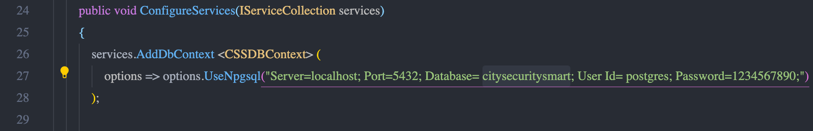
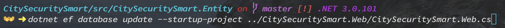

## Purpose

<b>City Security Smart (CSS)</b>: 
Güvenlik sistemlerinde görüntü içeriğinin otomatik olarak analiz edilmesi önemli bir ihtiyaçtır. CSS projesinin temel amacı, kavram tanıma konusundaki bilgi birikimi ve geliştirilen altyapıyı güvenlik sistemlerine uyarlamaktır.

# Table of Contents

* [Features](#features)
* [Prerequisites](#prerequisites)
* [Installation](#installation)
* [Found a Bug? Want to Contribute?](#found-a-bug-want-to-contribute)
* [Test](#test)
* [Production](#production)

## Features

* Tehlikeli label'ları manuel olarak database'e kaydetmek yerine bir machine learning servisi yazarak bu label' ları otomatik olarak elde edebiliriz.

* Bilir kişi raporunu otomatize hale getirebiliriz.

## Prerequisites

* Net Core 2.2
* NodeJS >= 10.x

* VSCode (ideally), or VS2017

## Installation

* Postgres kurulumunda parola olarak <b>1234567890</b>  eğer farklı bir şifre kullanmak isterseniz gerekli değişikliği Startup.cs dosyasında yapmanız lazım. 

  

* Terminalde CitySecuritySmart.Web içerisindeyken <b>npm install && yarn install</b> yazılıp çalıştırılması lazım.

*  CitySecuritySmart.Web içerisinde API' yi bağlamak için cloud shell içinde gerekli json dosyasının yolunun verilmesi lazım.
*  Postgres veritabanında <b>citysecuritysmart</b> adlı veritabanı oluşturulmalı farklı bir ad kullanılırsa yine kullandığınız ismi Startup.cs dosyasında değiştirmeniz lazım.

*  Terminal ekranında CitySecuritySmart.Entity dosya yolundayken <b>dotnet ef database update --startup-project ../CitySecuritySmart.Web/CitySecuritySmart.Web.cs</b> yazılmalı. Çıktı olarak postgres' de <b>citysecuritysmart</b> adlı veritabanın içerisinde tabloları oluşturması lazım. 

  

* Google cloud shell içerisindeyken CitySecuritySmart.Web dosya yoluna gidip <b>npm run dev && yarn dev</b> ile proje çalıştırılmalı. 
* Proje http://localhost:5000/ çalışır. Giriş yapma ekranı karşınıza gelirse ilk önce kayıt olmanız lazım, email ve şifrenizi girerek kayıt olabilirsiniz. 

* New Monitoring sayfasında input alanına <b>deneme.mp4</b> yazıp <b>save</b> butonuna basıp test edebilirsiniz. Bu sırada biraz beklememiz gerekebilir endişelenmeyin. Eğer <b>deneme.mp4</b> yazıp <b>save</b> butonuna tıkladığımızda biraz bekledikten sonra sağ üst köşede böyle bir video yok hatası alırsanız API' yi bağlarken hata yapmışsınızdır. Cloud Shell üzerinde json dosyasının yolu tekrardan verilmeli ve tekrardan test edilmeli. Video Intelligence API documentation'a
bu [linkten](https://cloud.google.com/video-intelligence/docs/quickstart) erişebilirsiniz. 

## Found a Bug? Want to Contribute?

* Kendi isminizde bir branch oluşturup bütün yaptığınız değişiklikleri oraya push etmeniz gerekir.
* GitHub Issues kısmında yapılması gerekenleri kabaca yazdım oraya bakıp gerekli desteği sağlayabilirsiniz.
* Eğer projede eksik gördüğünüz başka yer varsa GitHub Issues kısmına ekleyebilirsiniz.

* Bir bug ile karşılaşırsanız yine GitHub Issues kısmına ekleyebilirsiniz.

## Test

## Production
